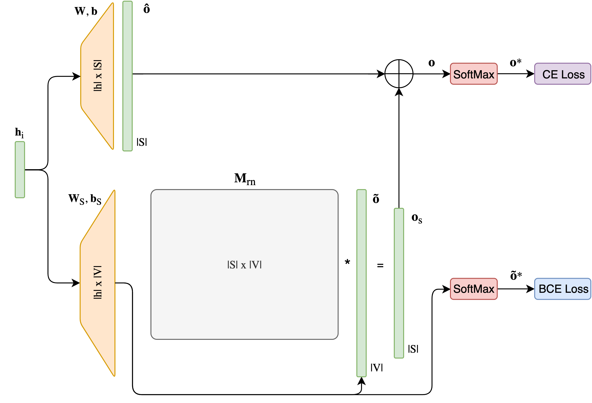
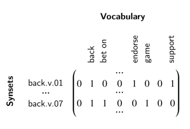

# Neural Word Sense Disambiguation integrating synonyms in WordNet synsets

## Intro

In this work we present a Word Sense Disambiguation (WSD) engine
that integrates a Transformer-based neural architecture with 
knowledge present in WordNet, the resource from which the sense 
inventory is taken from.

## Model

The architecture is composed of contextualized embeddings plus 
a Transformer on top with a final dense layer.

The models available include a base RoBERTa embeddings and are:
- `rdense` with only a two dense layer encoder.
- `rtransform` with a Transformer encoder.
- `wsddense` with a two dense layer encoder + an advanced lemma prediction net.
- `wsdnetx` same as above but with a Transformer encoder.

The advanced net can be represented as:



where h is the final hidden state of the encoder.
The |S|x|V| matrix is build like in the following:


## Training data

As a training dataset we use both SemCor and WordNet Gloss Corpus.

## Environment setup

```
git clone http://github.com/spallas/wsd.git

cd wsd/ || return 1

tmux new -s train

python -c "import torch; print(torch.__version__)"

source setup.sh
```

Unzip in the `res/` folder the pre-processed training and test data that you can download [here](https://spallas-dataset.s3.eu-west-3.amazonaws.com/wsd-train-and-test.zip). Also unzip in `res` dictinaries data that you can download [here](https://spallas-dataset.s3.eu-west-3.amazonaws.com/dictionaries.zip) 

## Further Details

Please refer to the [wiki page](https://github.com/spallas/wsd/wiki) in this 
repository for further details about the implementation.


## Notes: RoBERTa installation

```
# Download roberta.large model
cd res/
wget https://dl.fbaipublicfiles.com/fairseq/models/roberta.large.tar.gz
tar -xzvf roberta.large.tar.gz
```

```
# Load the model in fairseq
from fairseq.models.roberta import RobertaModel
roberta = RobertaModel.from_pretrained('res/roberta.large', checkpoint_file='model.pt')
roberta.eval()  # disable dropout (or leave in train mode to finetune)
```
